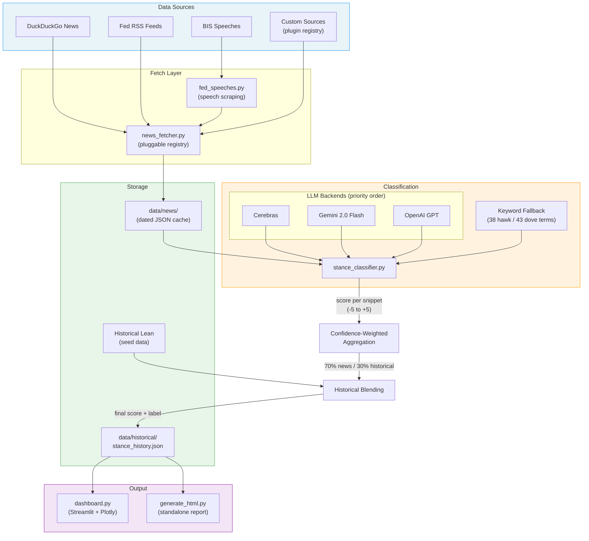

# FOMC Participant Stance Tracker

A real-time tracker that classifies Federal Reserve officials as **hawkish** or **dovish** based on recent news and speeches, displayed in an interactive Streamlit dashboard.

## Quick Start

```bash
poetry install && poetry shell

# Fetch latest data for all 19 FOMC participants
python fetch_data.py

# Launch the dashboard
streamlit run dashboard.py
```

## Data Sources

The tracker pulls text data from three sources for each FOMC participant (and notable incoming officials):

| Source | Method | Content |
|---|---|---|
| **DuckDuckGo News** | `duckduckgo-search` API | News headlines and summaries from the past month matching each participant's name + "Federal Reserve monetary policy" |
| **Fed RSS Feeds** | `feedparser` on federalreserve.gov | Official speeches, press releases, and testimony transcripts published by the Federal Reserve Board |
| **BIS Central Bankers' Speeches** | RSS feed from [bis.org/cbspeeches](https://www.bis.org/cbspeeches/index.htm) | Full-text speeches from the Bank for International Settlements archive, which curates policy-relevant speeches from central bankers worldwide including Fed officials |

### How each source works

1. **DuckDuckGo** — Searches `"{Name}" OR "{Last name}" Federal Reserve monetary policy` with a 1-month time filter. Returns up to 10 news headlines + summaries. A 1.5-second delay is enforced between requests to respect rate limits.

2. **Fed RSS** — Parses three official Federal Reserve RSS feeds (monetary policy decisions, speeches, testimony). Each item's title and summary are checked for the participant's last name or full name.

3. **BIS Speeches** — Parses the BIS central bankers' speeches RSS feed (`/doclist/cbspeeches.rss`), which provides structured metadata including speaker surname via `<cb:person>` and `<dc:creator>` tags. When a matching speech is found, the full text of the speech page is scraped from bis.org (truncated to 3,000 characters) to give the classifier more signal than a title alone. Speaker matching uses surname in the title prefix plus first-last name verification to avoid false positives on common surnames.

Results from all three sources are merged and cached as dated JSON files in `data/news/` so repeated runs on the same day don't re-fetch.

### Adding a Custom Data Source

The fetcher uses a plugin registry — you can add your own data sources without modifying `news_fetcher.py`. Each source is a function that takes a `Participant` and returns a list of dicts with five keys: `source`, `title`, `body`, `url`, `date`.

**Option A: `register_source()`**

```python
from fomc_tracker.news_fetcher import register_source

def fetch_from_my_api(participant, **kwargs):
    # Hit your API, read a CSV, query a database, etc.
    # participant.name is the full name, e.g. "Jerome H. Powell"
    return [
        {
            "source": "my_api",
            "title": "Powell signals patience on rates",
            "body": "Full article text for the classifier...",
            "url": "https://example.com/article",
            "date": "2026-02-16",
        }
    ]

register_source("my_api", fetch_from_my_api)
```

**Option B: `@data_source` decorator**

```python
from fomc_tracker.news_fetcher import data_source

@data_source("reuters")
def fetch_reuters(participant, **kwargs):
    ...
    return [{"source": "reuters", "title": "...", "body": "...", "url": "", "date": ""}]
```

**Managing sources at runtime:**

```python
from fomc_tracker.news_fetcher import list_sources, disable_source, enable_source

list_sources()                # [("duckduckgo", True), ("fed_rss", True), ...]
disable_source("duckduckgo")  # skip DuckDuckGo, keep the rest
enable_source("duckduckgo")   # re-enable it
```

Custom sources are called automatically by `fetch_news_for_participant` alongside the built-in ones. The returned dicts flow straight into the stance classifier — no other wiring needed.

## Classification Methodology

The classifier supports **LLM-based** and **keyword-based** modes. When an API key is configured, it routes through LLM backends in priority order: **Cerebras** (fastest) → **Gemini 2.0 Flash** → **OpenAI**. If no API keys are set (or all fail), it falls back to keyword matching. Both paths produce scores on the same **-5.0 to +5.0** scale across two dimensions.

### Two Dimensions

Stances are scored independently on two dimensions:

| Dimension | What it measures | Keyword dictionaries |
|---|---|---|
| **Policy** (interest rates) | Hawkish = raise/hold rates, dovish = cut rates | 38 hawkish terms, 43 dovish terms |
| **Balance Sheet** (QT/QE) | Hawkish = shrink balance sheet, dovish = expand/slow runoff | 13 hawkish terms, 15 dovish terms |

### Keyword Scoring

Each text snippet is scanned against the term dictionaries. Every term carries a **weight from 0.3 to 1.0** reflecting signal strength:

| Weight | Hawkish Examples | Dovish Examples |
|---|---|---|
| **1.0** (strongest) | "raise rates", "rate hike" | "cut rates", "rate cut" |
| **0.8–0.9** | "higher for longer", "premature to cut", "further tightening" | "ease policy", "ready to cut", "overly restrictive" |
| **0.5–0.7** | "sticky inflation", "overheating", "vigilant" | "disinflation", "recession risk", "downside risks" |
| **0.3–0.4** | "cautious", "patient", "wage growth" | "gradual", "balanced risks", "full employment" |

Matching is case-insensitive with collapsed whitespace. A term's weight is multiplied by its occurrence count in the text.

For each dimension, the per-snippet raw score is:

```
raw_score = 5.0 * (hawkish_total - dovish_total) / (hawkish_total + dovish_total)
```

This produces a value from **-5.0** (purely dovish) to **+5.0** (purely hawkish). A **confidence** value is also computed: `min(total_keyword_hits / 5.0, 1.0)`.

The per-snippet overall score combines the two dimensions: **70% policy + 30% balance sheet** (if balance sheet keywords are present; otherwise policy only).

### Multi-Snippet Aggregation

All snippets for a participant (typically 10–20 from news + RSS + BIS speeches) are classified individually, then combined using a **confidence-weighted average**:

```
final_score = sum(score_i * confidence_i) / sum(confidence_i)
```

This means snippets with more keyword matches carry more weight in the aggregate, while snippets with no relevant keywords are effectively ignored. Each dimension (policy, balance sheet) is aggregated independently.

### Historical Blending

The news-derived score is blended with a pre-set **historical lean** for each participant (based on their known policy track record). Each dimension is blended independently:

```
blended_policy = (news_policy * 0.70) + (historical_policy_lean * 0.30)
blended_bs     = (news_bs * 0.70)     + (historical_bs_lean * 0.30)
```

The overall score is then: **70% blended policy + 30% blended balance sheet**.

If no news is found at all, the historical lean is used directly as a fallback.

### Label Assignment

The final blended score is mapped to a label:

| Score Range | Label |
|---|---|
| > +1.5 | **Hawkish** |
| -1.5 to +1.5 | **Neutral** |
| < -1.5 | **Dovish** |

## Dashboard Charts

The Streamlit dashboard (`dashboard.py`) renders six chart sections plus detail views:

1. **Hawk-Dove Spectrum** — Horizontal bar chart ranking all participants from most dovish to most hawkish, with voter indicators
2. **2D Stance Map** — Scatter plot of policy score vs balance sheet score for each participant
3. **Committee Composition** — Donut chart showing the hawkish/neutral/dovish split
4. **Voters vs Alternates** — Dot plot comparing the stance distribution of 2026 voting members against non-voting alternates
5. **Stance Trends** — Line chart tracking how selected participants' stances have shifted month-to-month, with toggle between aggregate and per-dimension (policy & balance sheet) views. Supports click-to-inspect for viewing evidence articles.
6. **Stance Heatmap** — Color-coded matrix of all participants across all recorded dates

A **participant details table** and expandable **evidence cards** (with keyword highlights and dimension labels) are shown below the charts.

## Architecture



## Project Structure

```
fomc_tracker/
  participants.py          # 19-member FOMC roster with metadata
  news_fetcher.py          # Pluggable data source registry + built-in fetchers
  fed_speeches.py          # Federal Reserve speech scraping
  stance_classifier.py     # LLM + keyword classifier with dual-dimension scoring
  cerebras_classifier.py   # Cerebras LLM backend (primary)
  gemini_classifier.py     # Gemini 2.0 Flash LLM backend (fallback)
  openai_classifier.py     # OpenAI LLM backend (fallback)
  historical_data.py       # Stance history storage + seed data
fetch_data.py              # CLI orchestrator
dashboard.py               # Streamlit dashboard
generate_html.py           # Standalone HTML report generator
.github/workflows/
  daily-fetch.yml          # GitHub Actions daily data fetch
data/
  news/                    # Cached news JSON (date-prefixed, gitignored)
  historical/              # Persisted stance history
```

## CLI Reference

```bash
# Fetch and classify all 19 participants
python fetch_data.py

# List participants without fetching
python fetch_data.py --participants-only

# Fetch a single participant
python fetch_data.py --name "Jerome Powell"

# Force re-fetch (skip cache)
python fetch_data.py --no-cache
```

## LLM Configuration

The classifier tries LLM backends in order when API keys are present in `.env`:

| Backend | Env Variable | Model |
|---|---|---|
| Cerebras (primary) | `CEREBRAS_API_KEY` | Fastest inference |
| Gemini (fallback) | `GEMINI_API_KEY` | Gemini 2.0 Flash |
| OpenAI (fallback) | `OPENAI_API_KEY` | GPT |

If no keys are set, the system uses keyword matching only. All backends produce the same dual-dimension score format.

## Limitations

- **Keyword fallback** — Without LLM API keys, the classifier uses dictionary matching, which can miss nuanced or implicit policy signals and may be thrown off by negation ("will not raise rates" still matches "raise rates").
- **News availability** — Some participants generate more media coverage than others. Low-profile members may rely more heavily on the historical lean fallback.
- **No sentiment context** (keyword mode) — The system counts keyword occurrences without understanding surrounding context. A news article *about* a rate cut that quotes a hawk disagreeing would still register dovish keywords. LLM mode handles this better.
- **Single-day granularity** — Each fetch overwrites that day's cache. Intra-day stance shifts are not captured.
